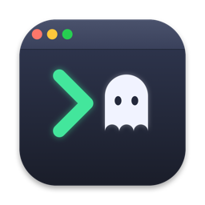
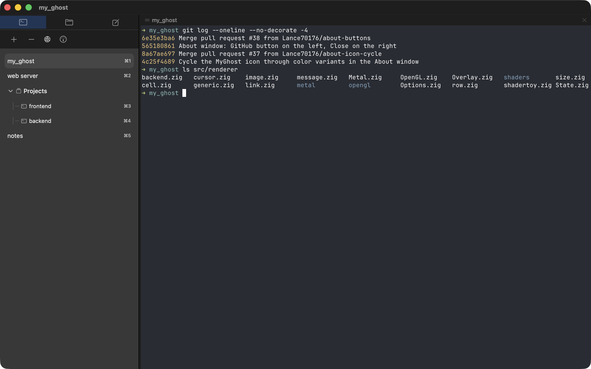
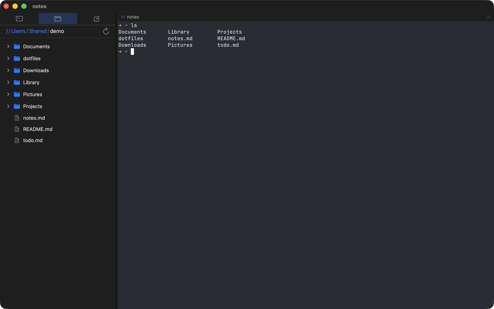
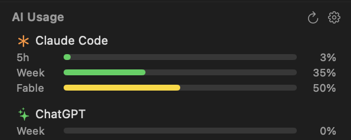

<p align="center">
  
</p>

<h1 align="center">MyGhost</h1>

<p align="center">
  A customized macOS terminal emulator based on <a href="https://github.com/ghostty-org/ghostty">Ghostty</a>,
  with sidebar tab management, persistent tmux sessions, remote SSH tabs, a built-in file browser, and an AI usage dashboard.
  <br />
  以 <a href="https://github.com/ghostty-org/ghostty">Ghostty</a> 為核心的 macOS 終端機，
  內建側欄分頁管理、tmux session 持久化、遠端 SSH 分頁、檔案總管與 AI 額度儀表板。
</p>

<p align="center">
  <a href="https://github.com/Lance70176/my_ghost/releases/latest/download/MyGhost.dmg"><b>⬇️ Download MyGhost.dmg（下載最新版）</b></a>
  ·
  <a href="https://github.com/Lance70176/my_ghost/releases">All releases（所有版本）</a>
</p>

---

## Screenshots · 截圖

**Sidebar tab management — tabs, groups, and ⌘1–9 switching**
**側欄分頁管理 — 分頁、分組與 ⌘1–9 快速切換**



**Built-in file browser — tree view, breadcrumb navigation, Quick Look**
**內建檔案總管 — 樹狀清單、路徑導覽列、快速預覽**



**AI usage dashboard — Claude Code / ChatGPT (Codex) quota at a glance**
**AI 額度儀表板 — 一眼掌握 Claude Code / ChatGPT (Codex) 用量**



---

## Features (English)

- **Sidebar tab management** — a visual tab list on the left instead of native tabs: drag to reorder, group tabs into collapsible Tab Areas (join / unjoin), rename tabs, and switch with `Cmd+1`–`Cmd+9` (group children included).
- **Persistent sessions** — every tab runs inside a local tmux session, so shells survive app quits, crashes, and reinstalls. Reopen the app and all tabs (including groups and their order) reattach automatically.
- **Remote SSH tabs** — open a tab that connects to a remote host over SSH into a persistent remote tmux session with automatic reconnection. Drag-select copy works in remote TUI apps (OSC 52 forwarding), and `Cmd+V` with an image on the clipboard uploads it to the remote host and pastes the file path — handy for tools like Claude Code running remotely.
- **File browser** — a sidebar file tree with breadcrumb navigation and auto-refresh: Quick Look preview (Space), rename (Enter), Move to Trash (`Cmd+Delete`), drag a file into the terminal to insert its path, and a right-click context menu (Open, Quick Look, Rename, Show in Finder).
- **Built-in text editor** — double-click a file in the browser to edit it in a Sublime-style editor pane with tabs and font zoom.
- **AI usage dashboard** — track Claude Code and ChatGPT (Codex) rate-limit windows (5h / week) per account, with usage bars, reset countdowns, and multi-account support. Sign in via the local CLI or paste a token.
- **Clipboard that just works in tmux** — drag-select copies even inside mouse-reporting TUI apps, and selections land straight on the macOS clipboard.
- **Everything Ghostty has** — GPU-accelerated rendering (Metal), splits, themes, fonts, and the rest of upstream Ghostty's features.

## 功能介紹（繁體中文）

- **側欄分頁管理** — 以左側視覺化清單取代原生分頁：拖曳排序、將分頁併入可收合的分組（join / unjoin）、重新命名，並可用 `Cmd+1`–`Cmd+9` 快速切換（分組內的子分頁也支援）。
- **Session 持久化** — 每個分頁都跑在本機 tmux session 裡，關閉 App、更新重裝甚至當機後，殼層程序都不會中斷；重新開啟 App 時所有分頁（含分組與排序）自動接回。
- **遠端 SSH 分頁** — 一鍵開啟連到遠端主機的分頁，殼層跑在遠端的持久化 tmux session，斷線自動重連。遠端 TUI 程式內拖曳選取可直接複製回 Mac 剪貼簿（OSC 52 轉發）；剪貼簿有圖片時按 `Cmd+V` 會自動上傳到遠端並貼上檔案路徑，遠端跑 Claude Code 等工具特別方便。
- **檔案總管** — 側欄樹狀檔案清單，支援路徑導覽列與自動刷新：空白鍵 Quick Look 預覽、Enter 重新命名、`Cmd+Delete` 丟到垃圾桶、拖曳檔案到終端機插入路徑，以及右鍵選單（開啟、預覽、重新命名、在 Finder 顯示）。
- **內建文字編輯器** — 在檔案總管雙擊檔案即可用 Sublime 風格的編輯器開啟，支援編輯分頁與字級縮放。
- **AI 額度儀表板** — 追蹤 Claude Code 與 ChatGPT (Codex) 各限額視窗（5 小時／週）的用量條與重置倒數，支援多帳號；可透過本機 CLI 登入或手動貼上 token。
- **tmux 下剪貼簿直覺可用** — 即使在啟用滑鼠回報的 TUI 程式裡，拖曳選取也能直接複製，選取內容即時同步到 macOS 剪貼簿。
- **保留 Ghostty 全部功能** — GPU 加速渲染（Metal）、分割視窗、佈景主題、字型設定等上游功能一應俱全。

---

## Installation · 安裝方式

1. Download [`MyGhost.dmg`](https://github.com/Lance70176/my_ghost/releases/latest/download/MyGhost.dmg).
2. Open it and drag **MyGhost.app** into **Applications**.
3. First launch: if macOS says the developer cannot be verified, right-click the app → **Open** → **Open**.

> The app is signed with a development certificate but not notarized by Apple — intended for personal / friends use.

1. 下載 [`MyGhost.dmg`](https://github.com/Lance70176/my_ghost/releases/latest/download/MyGhost.dmg)。
2. 開啟後把 **MyGhost.app** 拖到 **Applications**。
3. 首次開啟：若出現「無法驗證開發者」，請在 App 上按右鍵 →「打開」，再點一次「打開」即可。

> 本 App 以開發者憑證簽章、未經 Apple 公證（notarize），僅供個人與朋友間使用。

**Requirements · 系統需求**：macOS 13+；session persistence needs [tmux](https://github.com/tmux/tmux)（`brew install tmux`），session 持久化功能需要安裝 tmux。

---

## Building · 從原始碼建置

Requires [Zig](https://ziglang.org/) and Xcode.

```bash
# Debug build
zig build

# Release build
zig build -Doptimize=ReleaseFast

# Run
open zig-out/my_ghost.app

# Package a DMG (Xcode build + icon + signing)
./build/build_dmg.sh
```

## Credits

Based on [Ghostty](https://github.com/ghostty-org/ghostty) by Mitchell Hashimoto.
本專案基於 Mitchell Hashimoto 的 [Ghostty](https://github.com/ghostty-org/ghostty) 開發。
